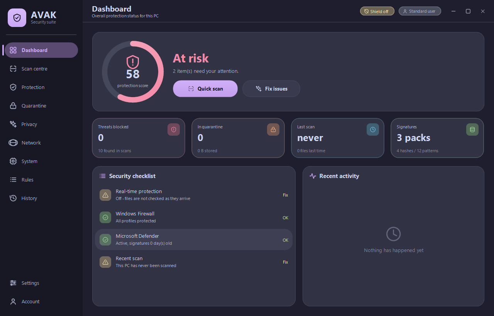
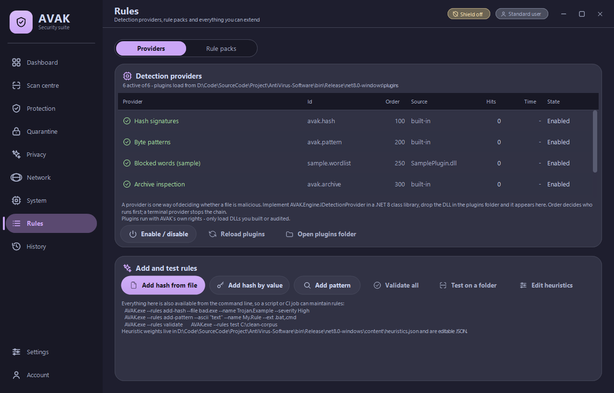
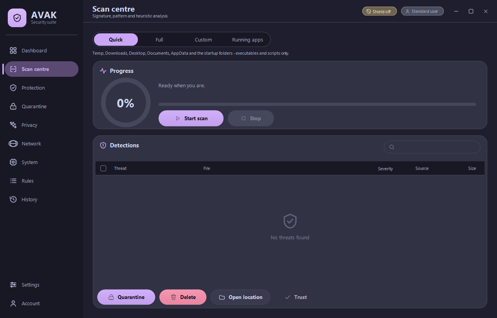
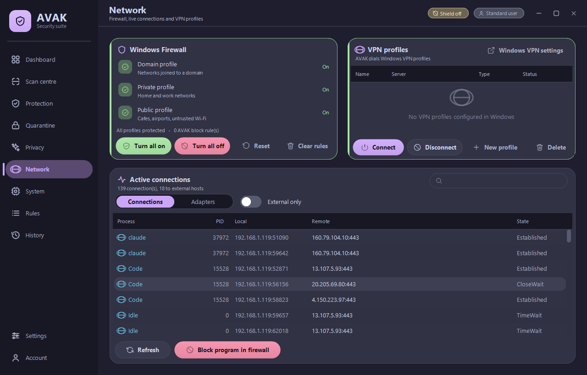
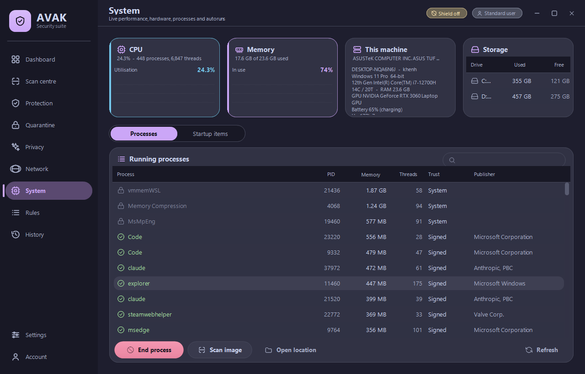
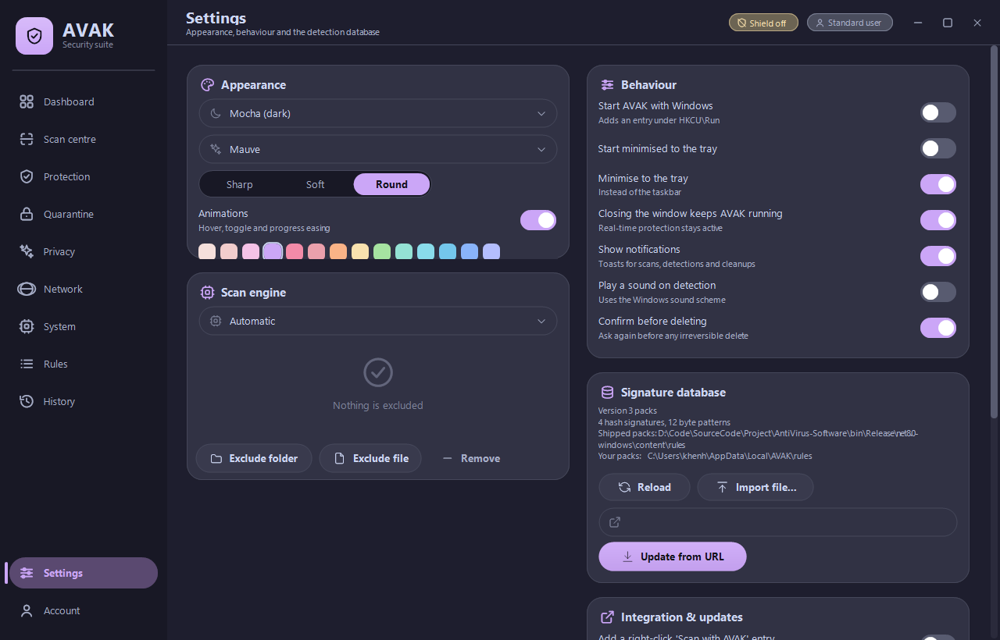

<div align="center">

# AVAK

**An extensible Windows security toolkit.**
VB.NET on .NET 8, themed with [Catppuccin](https://catppuccin.com).

[](#testing)
[](#testing)
[](#requirements)
[](https://dotnet.microsoft.com/download/dotnet/8.0)
[](LICENSE.txt)

</div>

AVAK is built as a **framework**. The shell, the scan loop and the UI are fixed;
almost everything that decides *what is malicious* is either a JSON file you edit
or a plugin you drop in a folder. Adding a hash, a byte pattern or a heuristic
weight needs no code at all. Adding a whole new detection technique needs one
interface and no registration.

> **Scope, stated plainly.** AVAK is a user-mode, second-opinion scanner. No kernel
> driver, no cloud reputation service, no behavioural sandbox. It complements
> Microsoft Defender; it does not replace it. Keep Defender enabled.

<div align="center">

</div>

---

## Extending it

| You want to… | How | Rebuild? |
|---|---|---|
| Add hashes or byte patterns | Rules page, `--rules` CLI, or edit a pack by hand | no |
| Retune the heuristics | Edit `heuristics.json` | no |
| Turn a detection engine on or off | Rules page, per provider | no |
| Detect something a new way | Implement `IDetectionProvider`, drop the DLL in `plugins\` | plugin only |
| Add a page to the UI | Subclass `ViewBase`, register it in `MainForm` | yes |

Guides: **[docs/ARCHITECTURE.md](docs/ARCHITECTURE.md)** ·
**[docs/EXTENDING.md](docs/EXTENDING.md)** · **[docs/RULES.md](docs/RULES.md)**

<div align="center">

<br><sub><i>Built-in providers and a plugin-supplied one, side by side. Both use the same interface.</i></sub>
</div>

### Add a rule in one command

```bat
AVAK.exe --rules add-hash --file suspicious.exe --name Trojan.Example --severity High
AVAK.exe --rules add-pattern --ascii "powershell -enc" --name My.EncodedPs --ext .bat,.cmd
AVAK.exe --rules validate
AVAK.exe --rules test C:\known-clean-folder     rem every hit here is a false positive
```

Rules are plain JSON, so a script or a CI job can maintain them:

```json
{
  "name": "My rules",
  "version": "2026.08.05",
  "hashes":   [ { "sha256": "275a021b…", "name": "Trojan.Example", "severity": "High" } ],
  "patterns": [ { "name": "My.Rule", "ascii": "text to find",
                  "severity": "Medium", "extensions": [".bat", ".cmd"] } ]
}
```

### Add a detection engine in one file

```vb
Public Class MyProvider
    Inherits DetectionProviderBase

    Public Overrides ReadOnly Property Id As String
        Get
            Return "example.mine"
        End Get
    End Property

    Public Overrides ReadOnly Property DisplayName As String
        Get
            Return "My detector"
        End Get
    End Property

    ' cheap filter - runs for every file, so never read anything here
    Public Overrides Function CanHandle(context As DetectionContext) As Boolean
        Return context.HasExtension(".ps1", ".bat")
    End Function

    Public Overrides Function Inspect(context As DetectionContext) As Detection
        If context.SizeBytes < 1024 * 1024 Then Return Nothing
        Return Detect(context, "Example:Script/Huge", Severity.Medium,
                      DetectionSource.Heuristic, 35,
                      "Script larger than 1 MB")
    End Function
End Class
```

Build it, copy the DLL to `plugins\`, restart. It appears on the Rules page with
its hit count and time spent, and can be switched off there.
[`samples/SamplePlugin`](samples/SamplePlugin) is a complete working example with
two providers.

---

## What it actually does

### Scan engine

- **Detection providers** run in order — hash 100, pattern 200, archive 300,
  heuristic 900 — with your plugins anywhere in between. A *terminal* provider
  stops the chain on a hit; a provider that throws is isolated and disabled after
  five failures rather than breaking the scan.
- **Rule packs** — SHA-256/MD5 hashes and wildcard hex/ASCII patterns, scoped by
  file extension and offset, loaded from any number of JSON files. Detections
  report which pack they came from.
- **Archive inspection** — ZIP, JAR, APK and the OOXML office formats are opened
  and every entry is scanned. Hardened against decompression bombs (per-entry cap,
  total budget, compression-ratio check, nesting limit) and Zip Slip entry names.
- **Static heuristics** — PE header parsing, per-section Shannon entropy (packer
  detection), writable+executable sections, risky import combinations, script
  obfuscation markers, Office VBA macros, `autorun.inf`, double extensions
  (`invoice.pdf.exe`), right-to-left-override filenames, extension/magic mismatch.
  Every weight and threshold lives in `heuristics.json`.
- **Profiles** — Quick, Full, Custom paths, Running apps. Parallel, cancellable,
  with wildcard exclusions (`*.iso`, `C:\Builds\*\bin\*`).

<div align="center">

</div>

### Quarantine

AES-256-CBC into a vault, with the per-item key protected by **DPAPI**. Restore
writes the exact original bytes back; permanent delete overwrites the vault copy
with random data before unlinking it. The `--selftest` command verifies this round
trip byte-for-byte.

### Real-time protection

`FileSystemWatcher` over the folders you choose, with event debouncing and a
single background worker so the UI never blocks. Configurable response: ask,
auto-quarantine, or report only.

### Network

Firewall state read through the `HNetCfg.FwPolicy2` COM interface (no elevation
needed to read), changed through `netsh` with a UAC prompt. Live TCP table via
`GetExtendedTcpTable` joined to the owning process. Adapter inventory. Per-program
block rules. Windows VPN profiles: list, create, connect, disconnect, delete.

<div align="center">

</div>

### System

Performance counters, `GlobalMemoryStatusEx`, WMI and registry hardware facts, a
process list with **Authenticode signature verification**, and a startup manager
covering `HKCU/HKLM Run`, `RunOnce` and both Startup folders. Disabling an autorun
entry parks it in a backup key instead of deleting it.

<div align="center">

</div>

### Privacy

Measured-before-deleted cleanup of temp folders, thumbnail and icon caches, crash
dumps, browser caches (Chrome/Edge/Brave/Firefox), shader caches and the Recycle
Bin, plus DNS flush, Run-history clearing and a hosts-file audit that flags
redirects of security and update domains.

### Everything else

Scheduled scans, scan history with exportable reports, an activity feed, rolling
logs, tray integration, an Explorer *"Scan with AVAK"* verb, an optional update
check, a local profile with a PBKDF2 PIN lock, and four Catppuccin flavours ×
fourteen accents with adjustable corner radius.

<div align="center">

</div>

---

## Requirements

- Windows 10 1809+ or Windows 11
- [.NET 8 Desktop Runtime](https://dotnet.microsoft.com/download/dotnet/8.0) to run
  — not needed for a `publish.bat` build, which is self-contained
- .NET 8 SDK or newer to build
- Administrator rights only for firewall changes, machine-wide autoruns and
  quarantining protected files. AVAK starts unelevated and asks when it needs more.

## Build

```bat
build.bat                     rem or: dotnet build AVAK.sln -c Release
dotnet test                   rem 82 unit tests
publish.bat                   rem self-contained single-file build in dist\
iscc installer\AVAK.iss       rem installer (needs Inno Setup 6)
```

`publish.bat` refuses to produce a build if the tests fail or if the published
binary fails its own self-test.

## Command line

```bat
AVAK.exe                        Normal GUI
AVAK.exe --tray                 Start hidden in the notification area
AVAK.exe --scan "C:\folder"     Headless scan; exit code = number of threats
AVAK.exe --scan --full          Headless scan of every fixed drive
AVAK.exe --scan-ui "C:\folder"  Open the GUI and scan that path (Explorer verb)
AVAK.exe --rules <verb>         Rule authoring - see docs/RULES.md
AVAK.exe --selftest             Engine self-test; exit code = number of failures
AVAK.exe --uitest <folder>      UI self-test: renders every page to a PNG
AVAK.exe --export-icon <file>   Regenerate the app icon from the vector shield
```

`--scan` also writes a JSON report to `%LOCALAPPDATA%\AVAK\data\cli-report.json`.

## Testing

```bat
dotnet build AVAK.sln -c Release   rem 0 errors, 0 warnings
dotnet test                        rem 82 passing
AVAK.exe --selftest                rem exit code 0
AVAK.exe --uitest .\shots          rem exit code 0
```

`--selftest` verifies that rule packs load, the pattern matcher fires on a known
signature, a quarantine encrypt → restore round trip reproduces the original bytes
exactly, and that settings persist.

`--uitest` constructs **every registered page** and saves a PNG of each, so adding
a page automatically extends the self-test. It has caught regressions a compile
could not: a null reference during construction, a docking-order mistake that hid
the sidebar, buttons overflowing their card.

The 82 unit tests cover the glob matcher, signature engine, heuristics, archive
scanner (Zip Slip and bomb guards), rule-pack validation, the rule store, provider
registry and context laziness, Catppuccin palette values, theme colour maths,
every icon in the set, the SVG path parser, formatting and the JSON store.

Two of them exist because they caught real bugs: a `Byte - Byte` overflow in the
colour mixer, and a VB inclusive-array-bound off-by-one.

## Keyboard

`Ctrl+1…9` jump to a page, `Ctrl+,` opens Settings, `Ctrl+L` locks the app.

## Where AVAK stores data

```
%LOCALAPPDATA%\AVAK\
  settings.json     preferences, disabled providers and packs
  profile.json      display name, avatar colour, PIN hash
  heuristics.json   your heuristic overrides (optional)
  rules\            your rule packs
  data\             scan history, activity feed, quarantine index
  quarantine\       AES-encrypted copies of detected files
  logs\             rolling text logs
```

Delete that folder and AVAK forgets everything. There is no account server and no
telemetry; the only outbound requests are ones you trigger yourself. See
[PRIVACY.md](PRIVACY.md) for the complete list.

## Project layout

```
src/Engine/       the extension surface: IDetectionProvider, DetectionContext,
                  ProviderRegistry, and the four built-in providers
src/Content/      rule packs, rule store, heuristic profile, --rules CLI
src/Security/     scan engine, matcher, heuristics, archives, quarantine, realtime
src/Core/         paths, logging, JSON, settings, elevation, shell integration
src/SystemInfo/   perf counters, hardware, processes, autoruns
src/Network/      firewall, TCP table, VPN
src/Privacy/      cleaner, Defender status, hosts guard
src/Theme/        Catppuccin palettes + ThemeManager
src/Ui/           SVG path parser, vector icons, custom controls, dialogs
src/Views/        one file per page
src/Forms/        the shell window

content/          shipped rule packs and heuristic weights - editable JSON
plugins/          drop your provider DLLs here
samples/          a working example plugin
docs/             architecture, extending, rule format, screenshots
tests/            unit tests
installer/        Inno Setup script
```

`CLASS/`, `CONTROL/`, `FORMS/`, `Custom Controls/`, `My Project/`, `Resources/`
and `NotError.*` are the original .NET Framework 4.x sources. They are kept for
reference and excluded from the build.

## History

This started as a learning project: a WinForms mockup on .NET Framework 4.5 whose
README advertised virus scanning, VPN, firewall control and performance monitoring
while the code behind those screens was empty event handlers. Version 2.0 replaced
it with a working implementation; 2.1 removed the last placeholder features and
added real archive scanning; 3.0 turned it into a framework. See
[CHANGELOG.md](CHANGELOG.md).

## Contributing

See [CONTRIBUTING.md](CONTRIBUTING.md). It includes the VB.NET traps this codebase
has already hit — case-insensitive identifiers shadowing types, `Byte - Byte`
overflow, inclusive array bounds — which will save you a build failure or two.

Rule packs are welcome. Say where the data came from, include your
false-positive test result, and never commit malware samples — hashes and
behaviour patterns only.

## Documents

| File | What it is |
|---|---|
| [docs/ARCHITECTURE.md](docs/ARCHITECTURE.md) | How the pieces fit and how a scan flows |
| [docs/EXTENDING.md](docs/EXTENDING.md) | Writing a detection provider |
| [docs/RULES.md](docs/RULES.md) | Rule pack and heuristics file formats |
| [CONTRIBUTING.md](CONTRIBUTING.md) | Build, definition of done, style, VB traps |
| [CHANGELOG.md](CHANGELOG.md) | What changed in each version |
| [PRIVACY.md](PRIVACY.md) | Every byte stored and every network call possible |
| [THIRD-PARTY-NOTICES.md](THIRD-PARTY-NOTICES.md) | Component licences and credits |

## Licence

MIT — see [LICENSE.txt](LICENSE.txt).

The Catppuccin palette is credited in
[THIRD-PARTY-NOTICES.md](THIRD-PARTY-NOTICES.md); the icon set is hand-authored
for this project.
